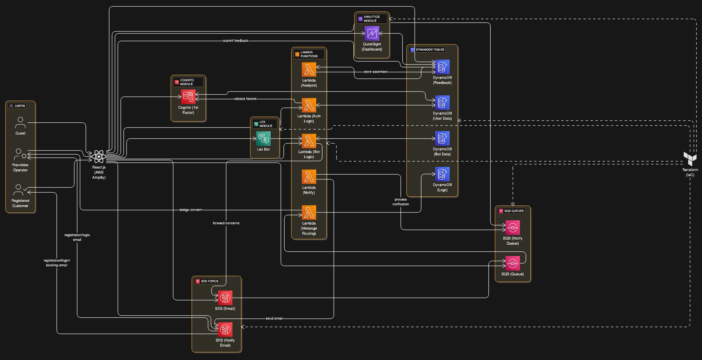

# 🛴 DalScooter - Campus Mobility Revolution

<div align="center">


🎉 **Welcome to the Future of Campus Transportation!** 🎉

**🎓 Dalhousie University's Premier Campus Transportation Solution**

[](https://aws.amazon.com/)
[](https://reactjs.org/)
[](https://www.typescriptlang.org/)
[](https://python.org/)
[](https://terraform.io/)
[](https://aws.amazon.com/lambda/)
[](https://aws.amazon.com/dynamodb/)
[](https://aws.amazon.com/api-gateway/)
[](https://aws.amazon.com/cognito/)


</div>

---

## 🌟 Overview

**DalScooter** is a cutting-edge, cloud-native micro-mobility platform designed specifically for Dalhousie University's campus community. Our comprehensive solution seamlessly integrates modern web technologies with robust cloud infrastructure to deliver an exceptional transportation experience for students, faculty, and staff.

<div align="center">

</div>

### 🎯 Mission Statement
> *Revolutionizing campus transportation through sustainable, accessible, and intelligent mobility solutions that connect our academic community.*

### 📊 Project Stats

<div align="center">

| Metric | Value |
|--------|--------|
| 🏗️ **Architecture Modules** | 4 Core Modules |
| ⚡ **Lambda Functions** | 30+ Serverless Functions |
| 🗄️ **Database Tables** | 8 DynamoDB Tables |
| 🌐 **API Endpoints** | 25+ REST APIs |
| 🤖 **AI Features** | Lex Chatbot + Sentiment Analysis |
| 📱 **Frontend Components** | React + TypeScript |
| ☁️ **Cloud Services** | 15+ AWS Services |

</div>

---

## ✨ Key Features

### 🚀 **For Students & Faculty**
- 🔍 **Real-time Bike Discovery** - Find available scooters, e-bikes, and Segways instantly
- 📱 **Smart Booking System** - Reserve your ride with just a few taps
- 🗺️ **Interactive Campus Map** - Locate nearby vehicles and drop-off points
- 💬 **AI-Powered Chatbot** - Get instant support and booking assistance
- 🏆 **Personalized Dashboard** - Track your rides, savings, and impact
- ⭐ **Review & Rating System** - Share experiences and help improve service

<div align="center">

</div>

### 🛠️ **For Administrators**
- 📊 **Comprehensive Analytics** - Real-time usage metrics and insights
- 👥 **User Management** - Customer support and account administration
- 🛴 **Fleet Management** - Monitor and manage vehicle inventory
- 💰 **Discount Management** - Create and manage promotional campaigns
- 📱 **Booking Oversight** - Monitor and approve reservations
- 📈 **Data Pipeline** - Advanced analytics and reporting capabilities

### 🤖 **Intelligent Features**
- 🧠 **AWS Lex Chatbot** - Natural language booking and support
- 📊 **Sentiment Analysis** - Automatic feedback categorization using AWS Comprehend
- 🔔 **Smart Notifications** - Email alerts for bookings and updates
- ⚡ **Real-time Processing** - SQS-powered message queuing
- 🔒 **Secure Authentication** - Multi-factor Cognito integration

<div align="center">

</div>

---

## 🏗️ Architecture

### 🎭 **4-Module Architecture**

> 📋 **Detailed Architecture Documentation**: Check out our comprehensive [System Architecture Guide](./Architecture/system_architecture.md) for in-depth technical diagrams and implementation details!

> 🖼️ **Architecture Diagram**: View our detailed [System Architecture Diagram](./Architecture/diagram-export-7-4-2025-10_23_37-AM.png) for visual representation of the system components.

<div align="center">

</div>

---

## 🚀 Quick Start Guide

### 📋 Prerequisites

```bash
# Required tools
✅ Node.js 20+ and npm
✅ Python 3.9+
✅ Terraform >= 1.0
✅ AWS CLI configured
✅ Git
```

### 🛠️ Installation Steps

#### 1️⃣ **Clone the Repository**
```bash
git clone https://github.com/DalScooter-Team1/DalScooter.git
cd DalScooter
```

#### 2️⃣ **Infrastructure Deployment**
```bash
cd infrastructure

# Configure AWS provider
cp terraform.tfvars.example terraform.tfvars
# Edit terraform.tfvars with your AWS credentials and settings

# Initialize and deploy
terraform init
terraform plan
terraform apply

# 📝 Note the outputs: API Gateway URL, Cognito Pool ID, and Client ID
```

#### 3️⃣ **Frontend Setup**
```bash
cd ../frontend

# Install dependencies
npm install

# Configure environment
cp .env.example .env.local
# Add the following to .env.local:
# VITE_SERVER=<API_GATEWAY_URL_FROM_TERRAFORM>
# VITE_COGNITO_USER_POOL_ID=<USER_POOL_ID_FROM_TERRAFORM>
# VITE_COGNITO_CLIENT_ID=<CLIENT_ID_FROM_TERRAFORM>

# Start development server
npm run dev
```

#### 4️⃣ **Access the Application**
```bash
# Frontend will be available at:
🌐 http://localhost:5173

# Admin Dashboard:
👨‍💼 http://localhost:5173/admin-dashboard

# Customer Dashboard:
👤 http://localhost:5173/customer-dashboard
```

---

## 📚 API Documentation

### 🔗 **Core Endpoints**

#### 👤 **Authentication**
```http
POST /register          # User registration
POST /admin             # Admin creation
POST /heartbeat         # User session tracking
```

#### 🛴 **Vehicle Management**
```http
GET    /bikes           # List all vehicles
POST   /bikes           # Add new vehicle
PUT    /bikes/{id}      # Update vehicle
DELETE /bikes/{id}      # Remove vehicle
GET    /bike-availability # Public availability check
```

#### 💰 **Discount System**
```http
GET    /discount-codes     # List discount codes
POST   /discount-codes     # Create discount code
PUT    /discount-codes/{id} # Update discount code
DELETE /discount-codes/{id} # Remove discount code
GET    /verify-discount/{code} # Validate discount code
```

#### 📅 **Booking Operations**
```http
POST /booking/request    # Create booking
GET  /my-bookings       # User's booking history
GET  /booking/admin     # Admin booking overview
```

#### 💬 **Communication**
```http
POST /submit-concern    # Submit customer concern
POST /respond-concern   # Admin response
GET  /messages          # Get concern messages
GET  /my-messages       # Customer message history
```

#### 📊 **Analytics**
```http
POST /feedback          # Submit feedback
GET  /feedback          # Retrieve feedback
GET  /customers         # Customer analytics
GET  /active-users      # Real-time user metrics
```

#### 🤖 **AI Assistant**
```http
POST /bot               # Chatbot interaction
```

---

## 🗄️ Database Schema

### 📊 **DynamoDB Tables**

#### 🛴 **Bikes Table** (`dalscooter-bikes`)
```json
{
  "bikeId": "string (PK)",
  "bikeType": "Gyroscooter|eBikes|Segway",
  "status": "active|inactive|maintenance",
  "franchiseId": "string",
  "accessCode": "string",
  "hourlyRate": "number",
  "features": {
    "heightAdjustment": "boolean",
    "batteryLife": "number",
    "maxSpeed": "number",
    "weight": "number"
  },
  "address": "string",
  "availability": "boolean",
  "model": "string"
}
```

#### 💰 **Discount Codes** (`dalscooter-discount-codes`)
```json
{
  "codeId": "string (PK)",
  "code": "string",
  "discountPercentage": "number",
  "expiryDate": "string",
  "expiryTimestamp": "number (TTL)",
  "status": "active|inactive",
  "usageLimit": "number",
  "usedCount": "number"
}
```

#### 📅 **Bookings** (`dalscooter-bookings`)
```json
{
  "bookingId": "string (PK)",
  "userId": "string",
  "bikeId": "string",
  "startTime": "string (ISO)",
  "endTime": "string (ISO)",
  "status": "pending|approved|active|completed|cancelled",
  "accessCode": "string",
  "totalCost": "number",
  "discountApplied": "string"
}
```

#### 💬 **Messages** (`dalscooter-messages`)
```json
{
  "messageId": "string (PK)",
  "timestamp": "number (SK)",
  "userId": "string",
  "content": "string",
  "messageType": "concern|response",
  "status": "pending|assigned|resolved",
  "assignedTo": "string",
  "sentiment": "positive|negative|neutral"
}
```

#### ⭐ **Feedback** (`dalscooter-feedback`)
```json
{
  "feedbackId": "string (PK)",
  "userId": "string",
  "bikeId": "string",
  "rating": "number (1-5)",
  "comment": "string",
  "sentiment": "positive|negative|neutral",
  "timestamp": "number",
  "processed": "boolean"
}
```

---

## 🔧 Configuration Guide

### 🌍 **Environment Variables**

#### **Frontend (.env.local)**
```env
# API Configuration
VITE_SERVER=https://your-api-gateway-url.amazonaws.com/prod/
VITE_COGNITO_USER_POOL_ID=us-east-1_xxxxxxxxx
VITE_COGNITO_CLIENT_ID=xxxxxxxxxxxxxxxxxxxxxxxxxx

# Feature Flags
VITE_ENABLE_ANALYTICS=true
VITE_ENABLE_CHATBOT=true
VITE_ENABLE_NOTIFICATIONS=true
```

#### **Infrastructure (terraform.tfvars)**
```hcl
# AWS Configuration
aws_region = "us-east-1"
environment = "production"

# Application Settings
app_name = "dalscooter"
domain_name = "dalscooter.ca"

# Database Configuration
mysql_host = "your-rds-endpoint.amazonaws.com"
mysql_port = 3306
mysql_database = "dalscooter"
mysql_username = "admin"
mysql_password = "your-secure-password"

# S3 Configuration
s3_bucket_name = "dalscooter-data-pipeline"

# GitHub Integration (for AWS Amplify)
github_access_token = "your-github-token"
```

---

## 🤝 Contributing Guidelines

<div align="center">

</div>

### 🎯 **Development Workflow**

#### **🌿 Branch Strategy**
```bash
main           # Production-ready code
develop        # Integration branch
feature/*      # New features
bugfix/*       # Bug fixes
hotfix/*       # Critical production fixes
```

#### **📝 Commit Convention**
```bash
# Format: type(scope): description
feat(auth): add multi-factor authentication
fix(booking): resolve booking confirmation email issue
docs(readme): update API documentation
test(frontend): add unit tests for bike components
```

#### **🔍 Code Review Process**
1. **Create Feature Branch** - From `develop`
2. **Implement Changes** - Follow coding standards
3. **Write Tests** - Maintain test coverage
4. **Submit PR** - Include description and screenshots
5. **Code Review** - At least 2 approvals required
6. **CI Checks** - All tests must pass
7. **Merge** - Squash and merge to `develop`

### 📋 **Quality Standards**

#### **🎨 Frontend Standards**
- **TypeScript** - Strict mode enabled
- **ESLint** - Airbnb configuration
- **Prettier** - Consistent code formatting
- **Testing** - React Testing Library + Jest

#### **🐍 Backend Standards**
- **PEP 8** - Python style guide compliance
- **Type Hints** - Full type annotation
- **Docstrings** - Comprehensive documentation
- **Testing** - Pytest with 90%+ coverage

## 🎉 Join the DalScooter Revolution!

<div align="center">

### 🌟 **Ready to Transform Campus Mobility?**


**Made with ❤️ by the DalScooter Team for the Dalhousie University Community**

*Ride Smart, Ride Sustainable, Ride DalScooter!* 🛴✨

---

<div align="center">

## 🎉 Join the DalScooter Revolution!

**Transform your campus experience with sustainable, intelligent mobility**

[](https://dalscooter.ca/register)
[](https://docs.dalscooter.ca)
[](mailto:support@dalscooter.ca)

</div>